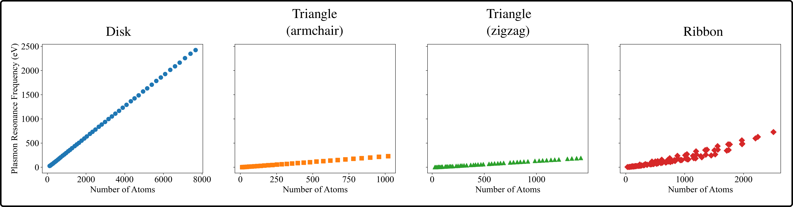

# plasmonX-PRF-analysis

This repository provides tools to analyze plasmon resonance frequencies (PRFs) from output files generated by the **plasmonX** code.

It allows users to:
- Extract the **maximum isotropic absorption** and associated **plasmon resonance frequency** from a set of plasmonX `.log` files.
- Save the results into a CSV file.
- Plot the resonance frequency against the number of atoms.

<p align="center">
  
</p>
<p align="center">
  <em>PRF as a function of the number of atoms on graphene samples with 4 different shapes.</em>
</p>


## Dependencies

- Python 3.8+
- numpy
- matplotlib

Install them with:

```
pip install -r requirements.txt
```


## Code Structure 

```
classes/
├── __init__.py
├── input_class.py
└── parameters.py

functions/
├── __init__.py
├── output.py
├── plasmonX_analysis.py
└── tools.py
```


## How to Use

### 1. Extract maximum absorption from plasmonX `.log` files

Run the following command to analyze a set of output files:

```
python3 plasmonX-PRF-analysis/ --read --files plasmonX-PRF-analysis/data/plasmonX-output-examples/*log
```

This generates the file `natoms_abs_freq.csv` containing:

```
# nAtoms Max_abs Associated_freq
462 0.6200000000 132.2000000000
116 0.7900000000 27.4900000000
...
```

### 2. Plot the data

Use the following command to create the figure:

```bash
python3 plasmonX-PRF-analysis --plot --files natoms_abs_freq.csv
```

This generates `plot.png`, showing plasmon resonance frequency as a function of the number of atoms.


## License

This code is licensed under the **GNU General Public License v3.0**.

## Contact

For issues or contributions:

- Email: **pgrobasillobre@gmail.com**
- Github issues: https://github.com/pgrobasillobre/plasmonX-PRF-analysis/issues

